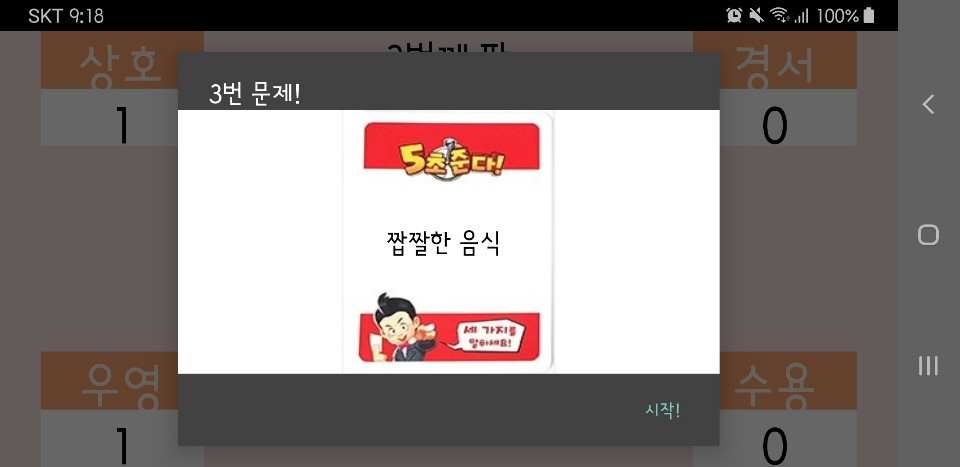
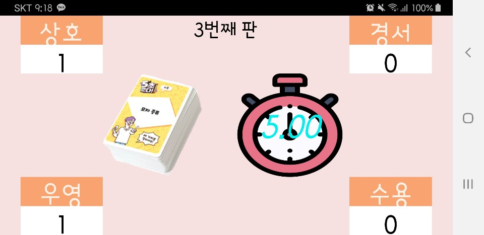

## 5초 준다!

   + 개발일정 : 2020.02.15 ~ 2020.02.18
   + 개발인원 : 김수용
   + 개발의도 : 동명의 보드게임 '5초 준다!'를 애플리케이션으로 제작하였습니다.     짧은 기간 내에 직접 사용할 애플리케이션을 만드는 것이 목표였습니다.
             
             
#### 사용시나리오
   1. 게임 시작 버튼을 누른 후, 화면의 카드 뭉치를 터치하면 제시어가 공개됩니다.
   2. 미리 정한 순서에 따른 이번 차례의 진행자가 참여자에게 "(제시어) 3가지!"를 외치며 시작 버튼을 터치합니다.
   3. 앱 내 5초 카운트가 끝날 때까지 첫번째 참여자가 해당 주제에 부합하는 단어를 3가지 말하지 못했다면, 다음 참여자에게 차례가 넘어갑니다.
   4. 한 참여자가 정답을 맞췄다면 해당 참여자의 영역으로 카드를 드래그하여 점수를 추가하고 역할을 변경합니다.

#### 기대효과(다른 앱과의 차별성)
   1. 스마트폰 하나만으로 보드게임을 즐길 수 있음
   2. 친구들과의 모임 등의 자리에서 약 1~2 시간의 놀이가 가능
   3. 원작 보드게임과 달리 애플리케이션 내 파일 수정을 통한 제시어 확장이 용이

#### 역할 분담
   - 김수용
      + AlertDialog를 활용한 제시어 공개
      + OnDragListener를 통한 카드 분배
      + CountDownTimer와 Thread를 활용한 타이머 기능
      + 파일 입출력을 통한 제시어 저장 및 불러오기
      + bgm, 효과음 제작
      

#### 앱 스크린샷

메인 화면, 제시어 , 게임 화면

