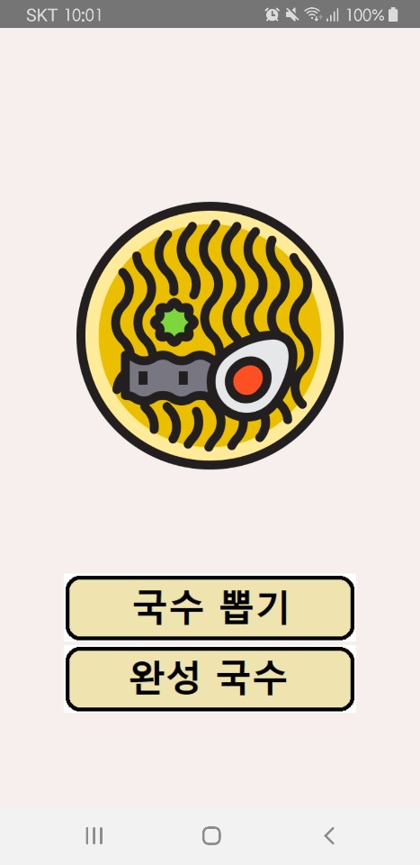
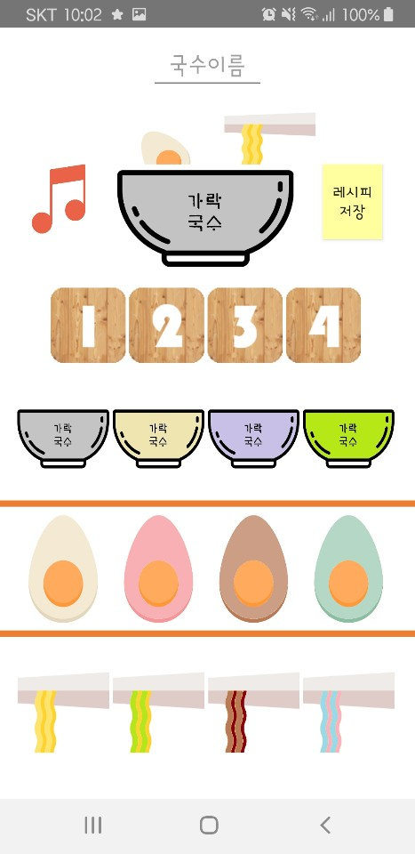
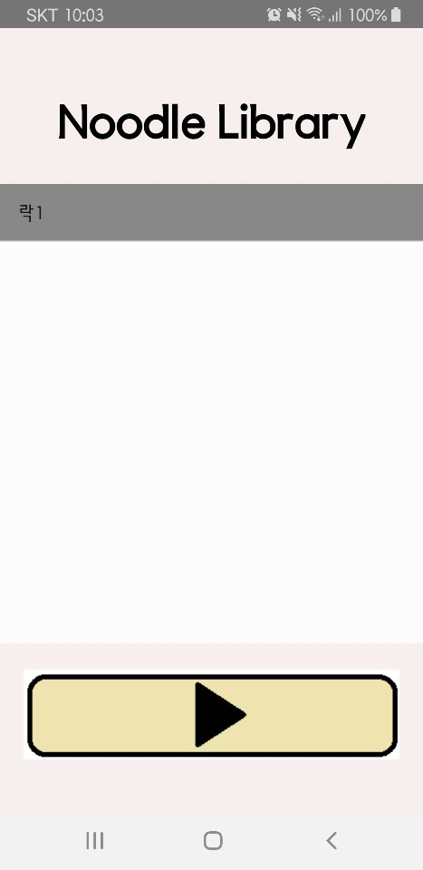

#### 모바일 프로그래밍 최종과제 - 가락국수

   + 개발일정 : 2019.11.01 ~ 2020.12.06
   + 개발인원 : 가락국수 팀 - 손우영(팀장), 김수용, 김관혁
   + 개발의도 : 일반인도 다루기 쉬운 간단한 작곡 앱을 만들고자 하였습니다.
               
             
             
#### 사용시나리오
   1. 세 가지 장르의 요리사 중 하나를 선택하여 고릅니다.
   2. 장르에 맞게 준비된 드럼, 기타, 베이스 등을 자유롭게 조합하여 음악을 만듭니다.
   3. 완성된 음악을 저장하여 언제든 다시 들어볼 수 있습니다.
   4. 마음에 들지 않는다면 다시 편집 화면으로 돌아와 수정할 수 있습니다.

#### 기대효과(다른 앱과의 차별성)
   1. 음악에 대한 이해가 깊지 않아도 click to play 방식을 통해 완성도 높은 음악을 만들 수 있습니다.
   2. 장르별로 준비된 드럼, 기타, 베이스 등의 악기를 하나씩 들어보며 자연스럽게 작곡 방법을 터득할 수 있습니다.
   3. 

#### 역할 분담
   - 손우영(팀장)
      + 파일 입출력
      + 완성된 가락(곡)을 저장 및 수정하는 기능 구현
   - 김수용(팀원)
      + 레이아웃 구현
      + 음악 제작
   - 김관혁(팀원)
      + SoundPool을 활용한 작곡 기능 구현
      + 요리사(장르) 선택 화면 제작
      

#### 시스템 구성도, 순서도

#### 개발 일정(2019.12.19 ~ 2020.09.22)

#### 앱 스크린샷

