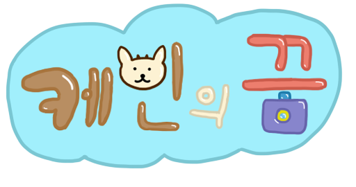

#### 인공지능을 활용한 아동용 영어교육 어플리케이션 - 케빈의 꿈

   + 개발일정 : 2019.12.19 ~ 2020.09.22
   + 개발인원 : 2공1타 팀 - 김수용(팀장), 이예지, 주지영
   + 개발의도 : 물체인식과 손글씨 인식을 활용한 6~7세 아동용 영단어 학습 앱을 만들고자 하였습니다.
               물체인식에는 Tensorflow Lite, 손글씨 인식에는 Firebase ML-kit를 활용하였습니다.
             
             
#### 사용시나리오
   1. 제시된 문제 중 하나를 선택하여 카메라로 해당 물체를 비춥니다.
   2. 물체인식에 성공하면 듣고 말하기가 시작됩니다.
   3. 사용자가 듣고 말하기를 수행하고 난 후 글씨 가이드에 따라 받아쓰기를 할 수 있게 됩니다.
   4. 받아쓰기까지 정확하게 입력하면 끝이 나며 카메라 인식시간과 받아쓰기 정확도에 따른 메달이 부여됩니다.

#### 기대효과(다른 앱과의 차별성)
   1. 주인공 케빈과 함께 영어를 학습하며 여행을 떠나는 스토리 구성
   2. 제시된 물체를 아이가 직접 찾아 카메라로 비추는 물체인식을 통한 자기주도학습 유도
   3. 물체 찾기>듣고 말하기>받아쓰기의 3단계를 통해 즐거운 사용자 경험을 제공

#### 역할 분담
   - 김수용(팀장)
      + 손글씨 기능 구현
      + runOnUiThread를 활용하여 물체인식 시 말하는 캐릭터 구현
      + inflater를 활용한 환경설정 등 개발
      + 캐릭터 디자인 및 bgm, 효과음 제작
   - 이예지(팀원)
      + SQLite를 활용한 DB 구현
      + 엔딩 및 크레딧 구현
      + 배경 및 아이콘 디자인
   - 주지영(팀원)
      + 튜토리얼 구현
      + 듣고 말하기 구현
      + 버튼 디자인
      

#### 시스템 구성도, 순서도

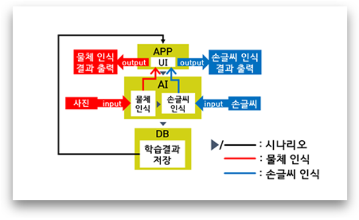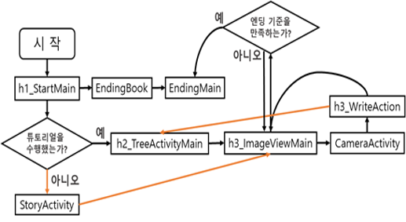

#### 개발 일정(2019.12.19 ~ 2020.09.22)

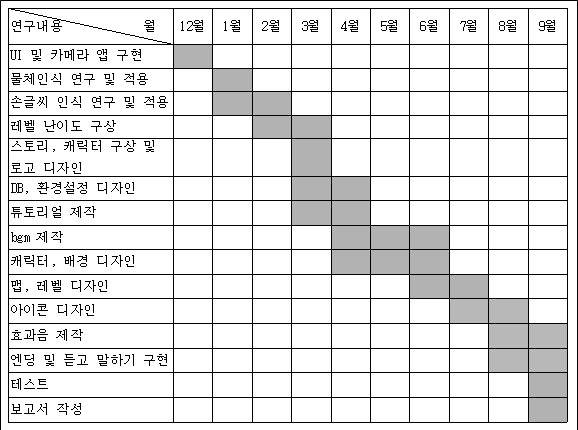

#### 앱 스크린샷

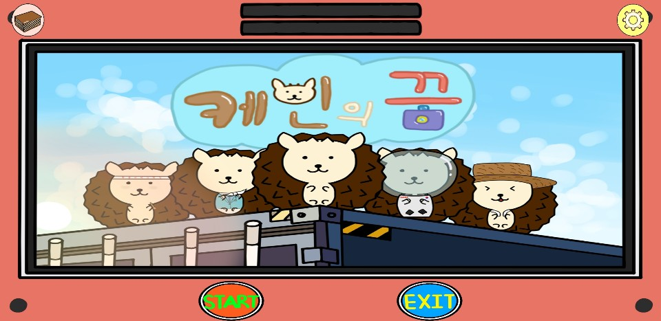

메인 화면, 튜토리얼

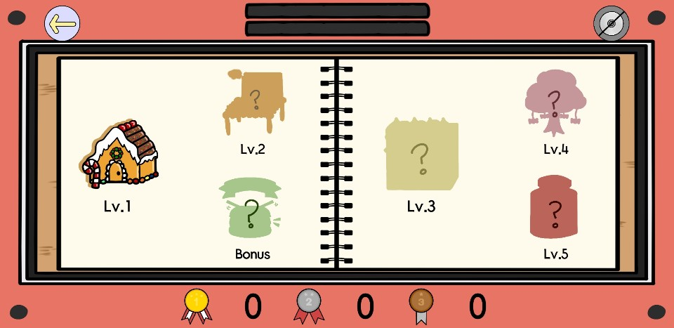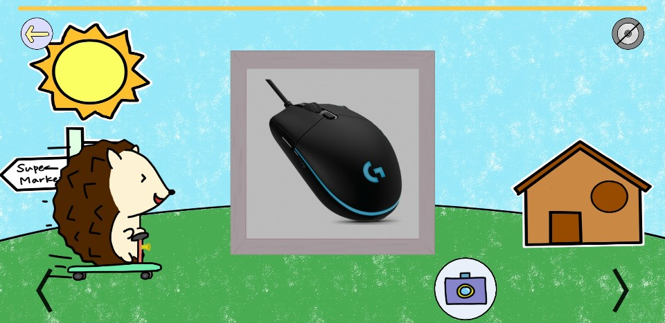

스테이지 선택, 문제 선택

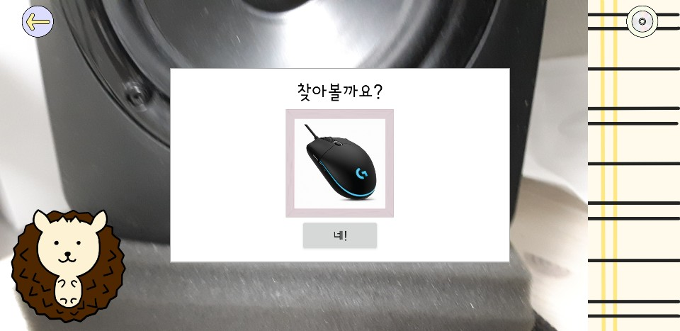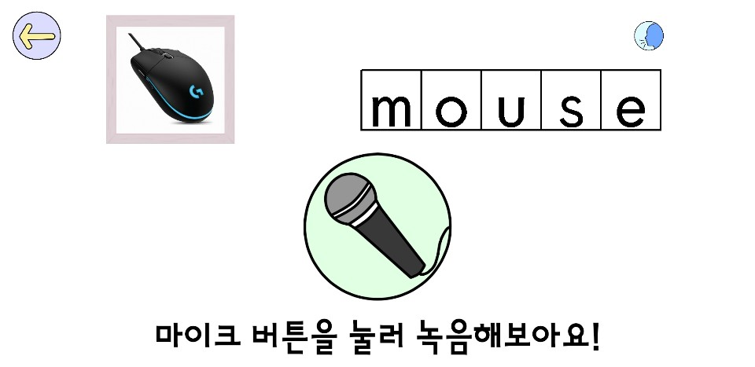

물체인식부, 듣고 말하기

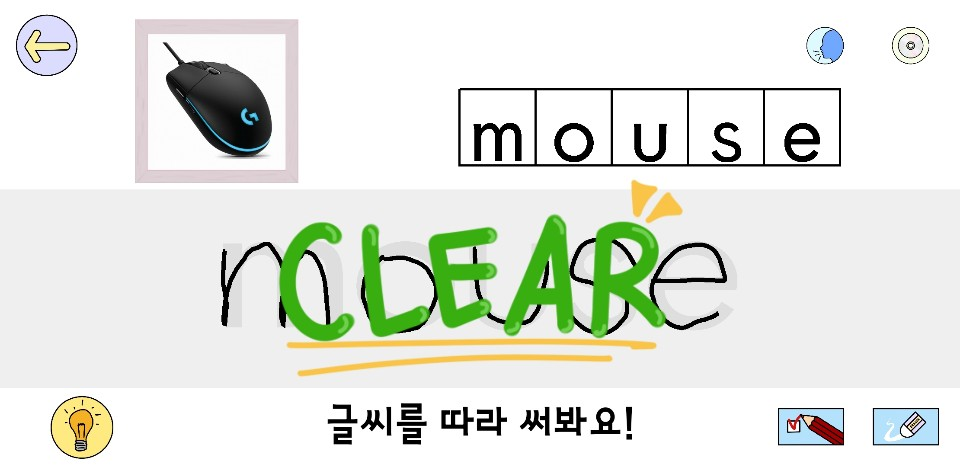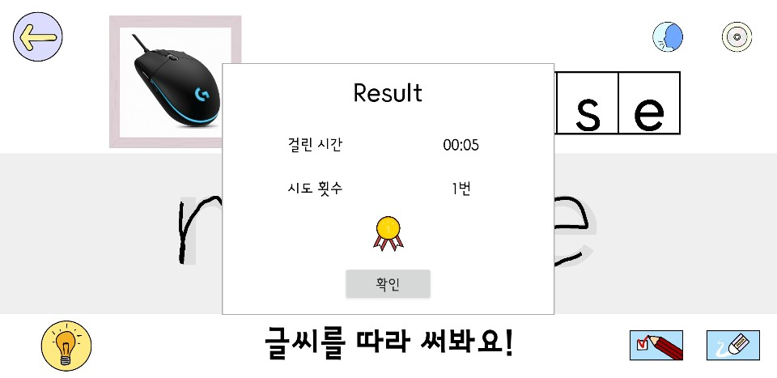

손글씨 인식부

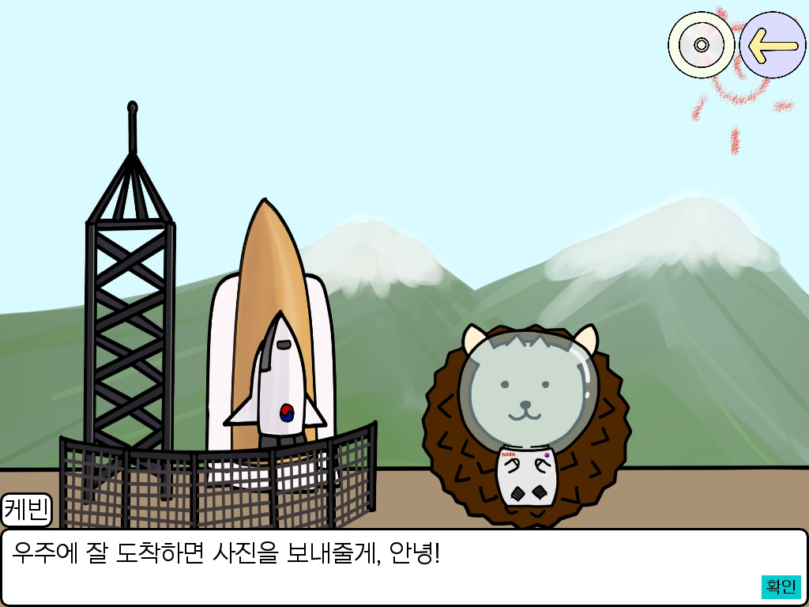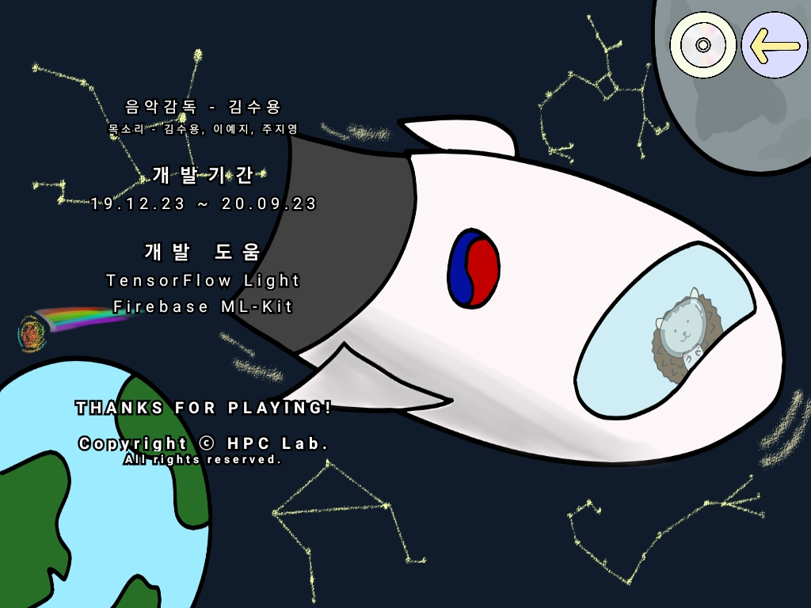

엔딩

#### 프로젝트 진행 중 느낀 점

   - 
   -
   - 액티비티 생명주기 등의 관리를 통한 에러 방지에 많은 시간과 노력을 들여야 한다. 실제 소비자에게 앱을 배포하기 전에 가능한 모든 경우의 수를 고려해 터치, 시스템 뒤로가기, 홈 화면 이탈 등을 시도해보고 오류를 검출한다.
   - 구글의 오픈소스 운영체제인 안드로이드를 탑재한 스마트폰은 수없이 많다. layout_weight와 sourcecrop등의 기능을 활용하여 최대한 다양한 기기에서 호환이 되도록 설계한다.
     
