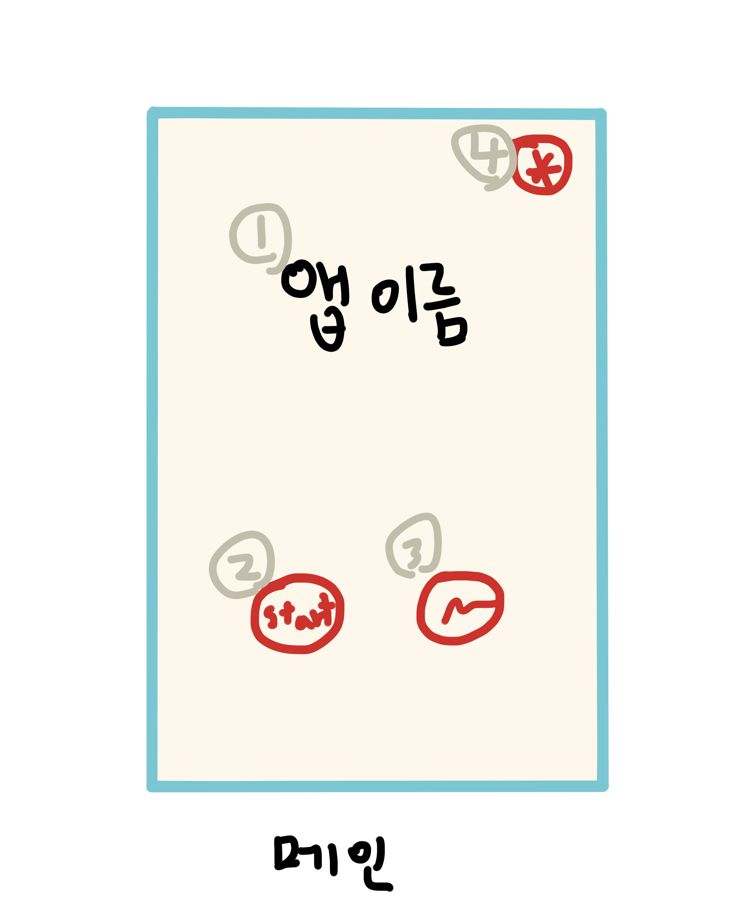

### 초기 기획

  앱 이름(가명) : 미니로직 - mini nonogram
  타겟층 : 네모네모로직을 좋아하는 전연령의 게이머   
  제공 가치 : 책으로 구입 시 흑백으로만 제시되던 문제들을 컬러로 제공, 사용자 본인이 직접 문제를 만드는 재미

### 액티비티 별 기능 구성(와이어 프레임)

#### 메인액티비티
1. 앱 이름
2. 게임 시작 버튼 > 스테이지액티비티로 이동
3. 창작마당 버튼 > 앨범액티비티로 이동
4. 환경설정 - inflater로 구현, bgm 코딩 시 중복되지 않도록 조심

※ 메인액티비티에서만 시스템 뒤로가기를 활성화시켜 게임을 종료할 수 있도록 코딩

#### 스테이지액티비티
1. 커스텀 리스트뷰를 만들어 터치 시 애니메이션으로 그리드 뷰를 보여주기, 
2. 터치 시 게임액티비티로 이동

※ DB 확인 후 클리어한 것만 컬러로 보여주기, 클리어한 그림을 꾹 누르면 inflater로 큰 그림 출력

#### 게임액티비티
1. onTouchListner, onDragListner를 활용하여 화면상 터치 좌표를 배열로 바꾸는 코딩 필요
2. 연필 모드 버튼
3. 지우개 모드 버튼(터치 시 X자로 표시)
4. 힌트 버튼 - 횟수에 제약을 두거나 Google Ad 시청 후 힌트 제공

※ onDragListner 코딩 시 가로세로 직선으로만 쓸 수 있도록 제약하기

※ 클리어 시 그리드와 숫자를 없앤 컬러 그림 출력 후 스테이지액티비티로 이동

#### 앨범액티비티
1. 사용자가 창작한 그림을 그리드로 출력, 꾹 눌러서 삭제 가능, 터치 시 게임액티비티로 이동
2. 새 그림 버튼, 터치 시 창작액티비티로 이동
3. 뷰 방식 변경 버튼, 정답뷰 <> 미스테리뷰

#### 창작(페인트)액티비티
1. 도트 그림을 그릴 수 있는 그림판, 게임액티비티의 클래스를 참고하여 코딩
2. 그림판 도구 버튼, 연필 - 지우개 - 색 지정
3. 뷰 방식 변경 버튼 - 로직 뷰 <> 그리드 뷰 <> 그림 뷰
4. 메뉴 버튼, 저장 - 불러오기 등의 버튼이 리스트로 배치됨, 저장 버튼 터치 시 앨범액티비티로 

※ 스택, 큐를 이용해 취소, 재실행 기능 구현

### 
